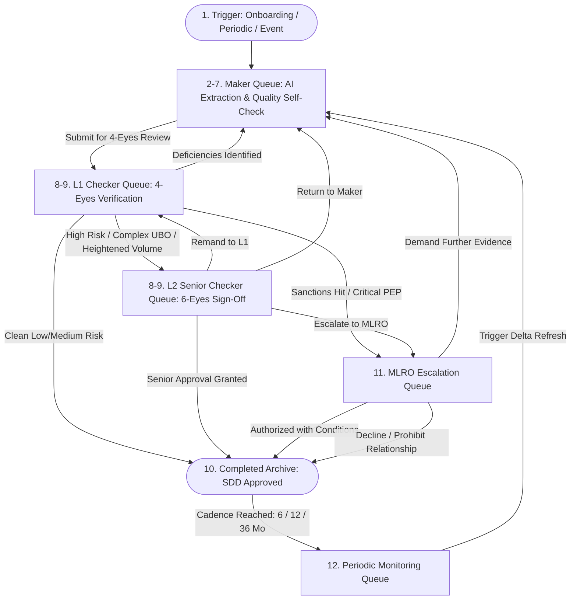

# KYC Maker — AI Compliance Assistant & Operational Queue System

An autonomous, multi-agent AI system for Know Your Customer (KYC) and Know Your Business (KYB) compliance. The **KYC Maker Agent** automates the entire 12-stage compliance lifecycle: document parsing, identity extraction, cross-document reconciliation, screening against global sanctions/PEP/adverse media registries, 5-factor Customer Risk Rating (CRR) scoring, 6-point Maker quality self-check, and multi-tier approval routing across **Maker**, **L1 Checker (4-Eyes)**, **L2 Senior Checker (6-Eyes)**, and **MLRO Escalation** queues.

---

## 🚀 Key Capabilities

1. **Operational Compliance Queues & 4-Eyes / 6-Eyes Governance**:
   - **Maker Queue**: AI data extraction, discrepancy flagging, screening alert investigations, and 6-point quality self-check.
   - **L1 Checker Queue (4-Eyes)**: Independent first-line compliance review. Approves Simplified Due Diligence (SDD) or escalates complex/high-risk files.
   - **L2 Senior Checker Queue (6-Eyes)**: Senior compliance sign-off for PEP relationships, complex corporate structures, or high-volume wire profiles.
   - **MLRO Escalation Queue**: Money Laundering Reporting Officer executive disposition for sanctions matches and regulatory exclusions.
   - **Periodic Monitoring Queue**: Automated surveillance triggering periodic re-KYC refreshes on 6, 12, 24, or 36-month cycles.
   - **Completed Archive**: Sealed immutable repository of approved SDD/EDD and closed cases.

2. **Multimodal Document Parsing & OCR**:
   - Ingests Passports, National IDs, Driver's Licenses, Utility Bills, Bank Statements, Certificates of Incorporation, and Articles of Association.
   - Structured extraction with per-field confidence scores and ICAO 9303 MRZ verification.

3. **Cross-Document Verification & UBO Analysis**:
   - Reconciles identities across files to detect name mismatches, expired credentials, address inconsistencies, or missing $\ge 25\%$ Ultimate Beneficial Owners (UBOs).

4. **Multi-List Screening & Alert Investigation**:
   - **Sanctions**: OFAC SDN, EU Consolidated, UN Security Council, and UK OFSI matching.
   - **PEP (Politically Exposed Persons)**: Tier-1 to Tier-3 government officials and close associates.
   - **Adverse Media**: Structured negative news surveillance with written disposition rationales.

5. **Multi-Scale Business Support**:
   - Pre-configured profiles and tailored workflows across **Micro SMB**, **Small Business**, **Medium Corporate**, **Large Enterprise**, and **XL Conglomerate** scales.

6. **Multi-Format Dossier Export**:
   - 1-Click export to **PDF Document (.pdf)**, **Excel Workbook (.xlsx)**, **CSV Tabular Log (.csv)**, and **Raw JSON Payload (.json)**.

---

## 🌐 Third-Party Compliance Intelligence Integrations

The KYC Maker Agent seamlessly orchestrates external compliance data providers with real-time payload hydration, intelligent cryptographic query hashing (`SHA-256`), and immutable audit logging:

1. **Dun & Bradstreet (D&B Direct+)**:
   - Corporate hierarchy resolution and verified 9-digit **D-U-N-S Number** linking.
   - **PAYDEX® credit & delinquency scoring** (1-100 index).
   - Multi-tier **Ultimate Beneficial Ownership (UBO $\ge 25\%$)** legal lineage tree.
   - Industry sector classification (SIC / NAICS codes), active operational status, annual revenues, and employee scale.

2. **LexisNexis (Bridger Insight® XG / WorldCompliance)**:
   - Real-time screening across OFAC SDN, EU Consolidated, UN Security Council, and UK OFSI sanctions lists.
   - Tier 1-3 Politically Exposed Persons (PEP) matching with relationship classification.
   - Adverse Media negative news indexing with exact article provenance, date of report, and risk categorization.
   - Search query hash validation and exact provider hit tracking for regulatory examination.

3. **GLEIF (Global Legal Entity Identifier Foundation)**:
   - 20-character alphanumeric **Legal Entity Identifier (LEI)** validation under ISO 17442.
   - Local Operating Unit (LOU) registration status and entity legal verification.

---

## 🔄 12-Stage KYC Process Flow & Record Movement



---

## ⚡ Quick Start

### 1. Start the Backend API (Port 8000)

```bash
cd backend
source ../.venv/bin/activate
uvicorn backend.app.main:app --reload --port 8000
```

The REST API and OpenAPI interactive documentation are accessible at:
- **API Docs**: [http://localhost:8000/docs](http://localhost:8000/docs)
- **Health Check**: [http://localhost:8000/api/health](http://localhost:8000/api/health)
- **Queue Stats**: [http://localhost:8000/api/stats](http://localhost:8000/api/stats)

### 2. Start the Frontend Cockpit (Port 5173)

```bash
cd frontend
npm run dev
```

Open [http://localhost:5173](http://localhost:5173) in your browser.

---

## 🧪 Demonstration Profiles Across Business Scales

| Case ID | Name / Entity | Scale / Type | Current Queue | Risk Tier & Drivers |
|---|---|---|---|---|
| **KYC-2026-0891** | Alexander James Wright | Retail Individual | Completed Archive | Low (12/100) — Approved SDD |
| **KYC-2026-0894** | Quantum Dynamics Technologies | Small Tech (SMB) | L1 Checker (4-Eyes) | Medium (48/100) — Multi-Director & UBO |
| **KYC-2026-0895** | Apex Nordic Seafood AS | Small SMB | L1 Checker (4-Eyes) | Low (22/100) — Cross-border EU Fishing |
| **KYC-2026-0896** | Veritas Logistics Global | Medium Corp | L2 Senior (6-Eyes) | High (68/100) — Dual-use Maritime Shipping |
| **KYC-2026-0897** | Nexus Pay Financial Ltd | Medium FinTech | L2 Senior (6-Eyes) | High (72/100) — PSP Third-Party Processing |
| **KYC-2026-0898** | Aethelgard Heavy Industries | Large Enterprise | Maker Queue | High (64/100) — In-Flight Self-Check |
| **KYC-2026-0899** | Atlas Trans-Oceanic Energy | XL Conglomerate | MLRO Escalation | High (74/100) — $250M/mo Wire Threshold |
| **KYC-2026-0892** | Elena Rostova | Individual PEP | MLRO Escalation | High (76/100) — PEP Ministerial Linkage |
| **KYC-2026-0893** | Tariq Al-Mansoor | Individual Sanctions | MLRO Escalation | Critical (98/100) — OFAC SDN Match |

---

## 📋 REST API Reference

- `GET /api/stats`: Retrieve live queue counts (`maker_queue_count`, `l1_checker_queue_count`, `l2_checker_queue_count`, `mlro_queue_count`, `monitoring_queue_count`, `completed_archive_count`).
- `GET /api/cases`: List all active KYC cases with queue locations and risk ratings.
- `POST /api/cases`: Create a new individual or corporate KYC case.
- `GET /api/cases/{id}`: Fetch complete case dossier, extracted data, risk score, memo, and queue history.
- `POST /api/cases/{id}/documents`: Ingest a new credential document and trigger instant extraction.
- `POST /api/cases/{id}/analyze`: Re-run the KYC Maker AI Agent pipeline.
- `POST /api/cases/{id}/sync-external-intelligence`: On-demand live synchronization with Dun & Bradstreet, LexisNexis Bridger Insight, and GLEIF.
- `POST /api/cases/{id}/submit-to-checker`: Transition case from Maker Queue to L1 Checker Queue.
- `POST /api/cases/{id}/decision`: Submit L1 or L2 Checker review (`APPROVED_SDD`, `APPROVED_EDD`, `PENDING_L2_CHECKER`, `RETURNED_TO_MAKER`, `RETURNED_TO_L1`, `ESCALATED_MLRO`).
- `POST /api/cases/{id}/mlro-decision`: Record MLRO executive determination (`APPROVED`, `RETURNED`, `REJECTED`).
- `POST /api/cases/{id}/periodic-review`: Trigger periodic re-KYC refresh cycle.
- `POST /api/cases/reset`: Restore default demo distribution across queues.

---

## 🛡️ Automated Tests

```bash
.venv/bin/pytest -v
```

12/12 comprehensive automated unit and integration tests passing.
