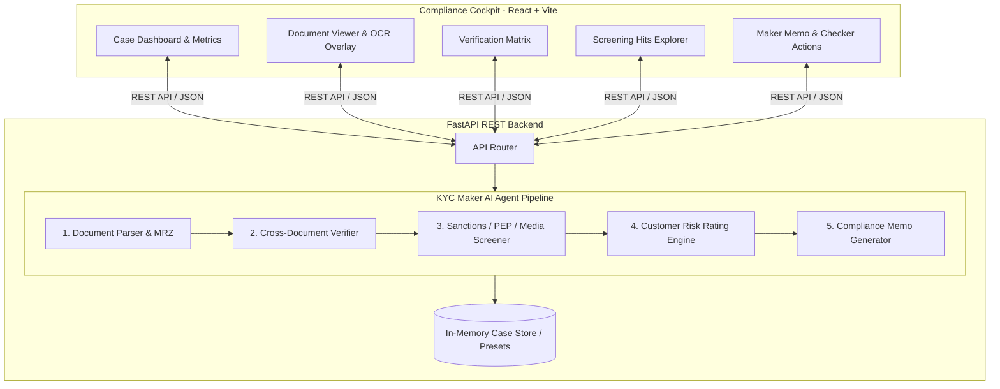

# KYC Maker — AI Compliance Assistant

An autonomous, multi-agent AI system for Know Your Customer (KYC) and Know Your Business (KYB) compliance. The **KYC Maker Agent** automates document parsing, identity extraction, cross-document reconciliation, screening against global sanctions/PEP/adverse media registries, Customer Risk Rating (CRR) scoring, and synthesis of executive compliance dossiers for human **Compliance Checkers**.

---

## 🚀 Key Capabilities

1. **Multimodal Document Parsing & OCR**:
   - Ingests Passports, National IDs, Driver's Licenses, Utility Bills, Bank Statements, and Certificates of Incorporation.
   - Extracts structured identity fields with per-field confidence scores and ICAO 9303 MRZ verification.
2. **Cross-Document Consistency Verification**:
   - Compares metadata across submitted files to detect name mismatches, expired credentials, address discrepancies, or missing UBO identification.
3. **Automated Screening & Negative News Surveillance**:
   - **Sanctions**: OFAC SDN, EU Consolidated, UN Security Council, and UK OFSI matching.
   - **PEP (Politically Exposed Persons)**: Identifies senior government officials, ministers, and close associates.
   - **Adverse Media**: Tracks financial crimes, money laundering probes, regulatory enforcement, and bribery investigations.
   - **Jurisdiction Risk**: Evaluates FATF high-risk jurisdictions, blacklists, and grey lists.
4. **Customer Risk Rating (CRR) Engine**:
   - Computes weighted risk scores (0–100) mapping to regulatory tiers (`LOW`, `MEDIUM`, `HIGH`, `CRITICAL`).
   - Recommends due diligence protocols (`Standard SDD`, `Enhanced EDD`, `RFI Required`, `Prohibited`).
5. **AI Maker Case Dossier & Compliance Memo**:
   - Synthesizes an executive compliance memo detailing findings, line-by-line identity audit, false-positive analysis, and recommended action.
6. **Modern Compliance Cockpit (React + Vite)**:
   - High-density dark mode dashboard with live case queue, circular risk gauges, side-by-side document inspection, and 1-click Checker sign-offs (`Approve SDD`, `Approve EDD`, `Request RFI`, `Reject`).

---

## 🏗️ Architecture



---

## ⚡ Quick Start

### 1. Start the Backend API (Port 8000)

```bash
cd backend
source ../.venv/bin/activate
uvicorn backend.app.main:app --reload --port 8000
```

The REST API and interactive OpenAPI documentation will be accessible at:
- **API Docs**: [http://localhost:8000/docs](http://localhost:8000/docs)
- **Health Check**: [http://localhost:8000/api/health](http://localhost:8000/api/health)

### 2. Start the Frontend Cockpit (Port 5173)

```bash
cd frontend
npm run dev
```

Open [http://localhost:5173](http://localhost:5173) in your browser.

---

## 🧪 Built-in Demonstration Scenarios

The system comes preloaded with four representative compliance onboarding cases:

| Case ID | Name / Entity | Type | Highlights & Risk Drivers | Maker Recommendation |
|---|---|---|---|---|
| **KYC-2026-0891** | Alexander James Wright | Individual | Clean US Passport & Utility Bill, 0 screening hits | `APPROVE_SDD` (Low Risk - 12/100) |
| **KYC-2026-0892** | Elena Rostova | Individual | Former Deputy Minister of Energy (PEP) + Adverse Media | `APPROVE_EDD` (High Risk - 76/100) |
| **KYC-2026-0893** | Tariq Al-Mansoor | Individual | Direct match on OFAC SDN sanctions list + expired ID | `REJECT_PROHIBITED` (Critical - 98/100) |
| **KYC-2026-0894** | Quantum Dynamics Technologies Ltd | Corporate | Multi-director structure, 2 UBOs, PSC filing inquiry | `REQUEST_RFI` (Medium Risk - 48/100) |

---

## 📋 REST API Reference

- `GET /api/cases`: Retrieve all onboarding cases and risk summaries.
- `POST /api/cases`: Create a new individual or corporate KYC/KYB case.
- `GET /api/cases/{id}`: Fetch complete case dossier, extracted data, risk score, and Maker memo.
- `POST /api/cases/{id}/documents`: Ingest a new document (text or PDF) and run instant analysis.
- `POST /api/cases/{id}/analyze`: Trigger / Re-run the KYC Maker AI Agent on a case.
- `POST /api/cases/{id}/decision`: Submit Checker sign-off (`APPROVED_SDD`, `APPROVED_EDD`, `RFI_REQUESTED`, `REJECTED`).
- `POST /api/cases/reset`: Restore the initial demo presets.
- `GET /api/stats`: Compliance metrics (Pending review, High risk alerts, Approval counts).

---

## 🛡️ Running Automated Tests

```bash
.venv/bin/pytest -v
```
